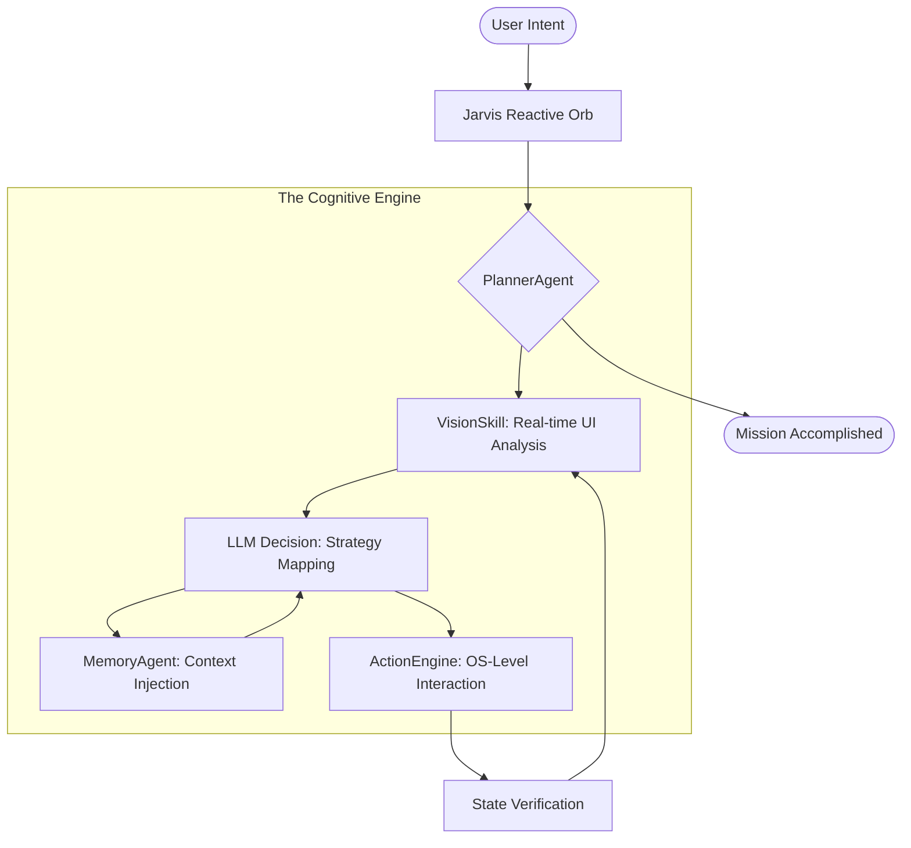

<p align="center">
  
</p>

<h1 align="center">🌌 JARVIS AI: SENTINEL OS</h1>
<p align="center">
  <b>The Future of Autonomous Mobile Interaction</b><br>
  <i>A professional-grade personal intelligence layer for Android.</i>
</p>

<p align="center">
  
  
  
</p>

<p align="center">
  
</p>

---

## 📱 Experience True Autonomy

Jarvis isn't just a chatbot; it's a **Sentinel**. It observes your screen, understands your intent, and executes tasks with human-like precision. By removing the friction between thought and action, Jarvis becomes your digital twin.

<p align="center">
  <table align="center">
    <tr>
      <td align="center">
        <br>
        <i>Intelligent Conversation</i>
      </td>
      <td align="center">
        <br>
        <i>Autonomous Control</i>
      </td>
    </tr>
  </table>
</p>

### ⚡ Professional Workflow Orchestration
> **User:** "Jarvis, I'm feeling happy, play something matching."
> <br>**Jarvis:** Opening Spotify... Analyzing Library... Playing **'Happy'** by Pharrell Williams. 🚀

---

## 🚀 Advanced Capabilities

### 👁️ 1. Visionary Screen Perception
The **Sentinel Vision Engine** uses a dual-layer approach to understand your device:
- **Spatial Reasoning:** Locates UI elements based on visual patterns, not just static IDs.
- **Icon Intelligence:** Custom TFLite models recognize your favorite apps and actions instantly.
- **Live Context:** Understands the "State" of an app to decide the next logical step.

### 🧠 2. Continuous Learning Memory
Your Jarvis grows smarter every day through its **16-Module Core**:
- **Episodic Memory:** Recalls complex task sequences you've performed before.
- **Preference Mapping:** Automatically learns your music, social, and professional habits.
- **Semantic Search:** Instant context retrieval via a local vector database.

### 🛡️ 3. Hardened Security & Privacy
- **Zero-Cloud Memory:** Your personal data never leaves your device.
- **Biometric Vault:** Protect your agentic capabilities with Fingerprint or Face ID.
- **Encrypted Secrets:** API keys and sensitive tokens are managed by the Android Keystore.

---

## 🏗 System Architecture



---

## 🔧 Pro Tech Stack

| Layer | Technology |
| :--- | :--- |
| **Logic** | Kotlin 1.9, Coroutines, Hilt |
| **Vision** | Google ML Kit + MobileNet V3 |
| **Backend** | Python 3.11, FastAPI, WebSockets |
| **Memory** | ChromaDB + ONNX Embeddings |
| **Interface** | Framer Motion & Lottie Animations |

---

## 🛠 Quick Deployment

```bash
# Clone the repository
git clone https://github.com/patil-shubham-dev/Jarvis-Ai.git

# Initialize the Sentinel
cd Jarvis-Ai/app
./gradlew installDebug
```

> [!IMPORTANT]
> Ensure **Accessibility Services** are enabled for Jarvis to perform autonomous actions. See the [Setup Guide](docs/SETUP_GUIDE.md) for more.

---

<p align="center">
  <b>Jarvis AI: Sentinel OS</b><br>
  Developed with ❤️ by <a href="https://github.com/patil-shubham-dev">Shubham Patil</a><br>
  <i>Leading the transition to Agentic Computing.</i>
</p>
