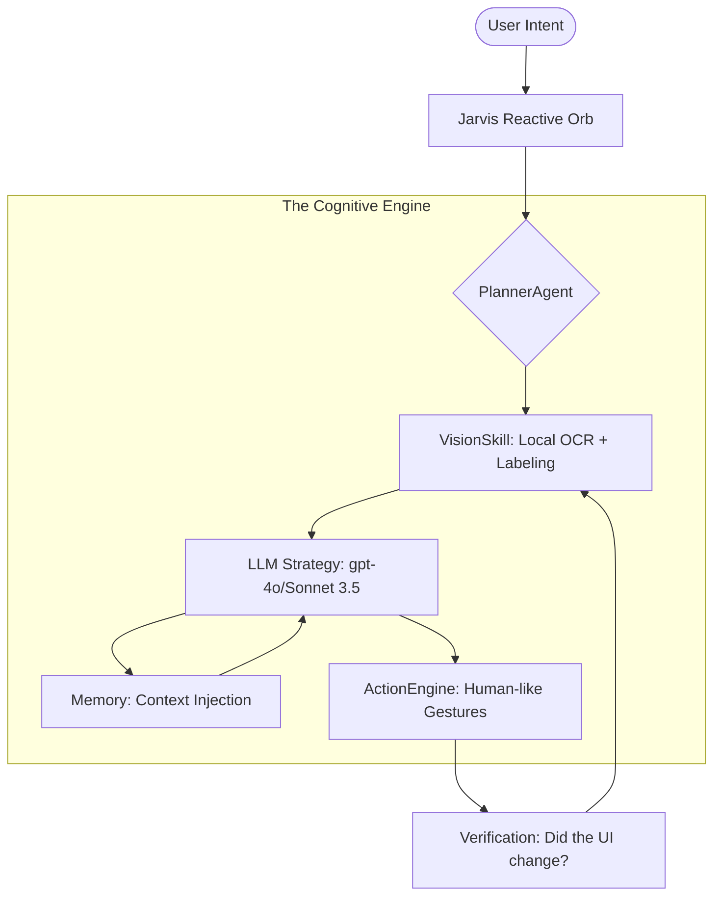

🌌 JARVIS AI: SENTINEL OS V4.1
==============================

[](https://github.com/patil-shubham-dev/Jarvis-Ai/releases)
[](https://github.com/patil-shubham-dev/Jarvis-Ai/actions)

**Jarvis Sentinel V4.1** is a high-fidelity, autonomous mobile agent designed to bridge the gap between human intent and device execution. Unlike traditional assistants, Jarvis utilizes **Local Vision (MobileNet V3)** and a recursive **Observe-Think-Act** loop to control any Android application without pre-built integrations.

---

## 🚀 Recent Breakthroughs (v4.1)

### 👁️ Resilient Vision Engine
*   **Local Processing**: Integrated **MobileNet V3** via ML Kit for 100% on-device visual labeling and OCR.
*   **Hardware-to-Software Fallback**: Robust bitmap processing for modern GPUs (Realme/Oppo/Samsung support).
*   **Context Optimization**: Automatic "Keyboard Filtering" to reduce LLM prompt bloat by 70%, ensuring lightning-fast decision making.

### 🤖 Autonomous Brain (Sentinel Core)
*   **Recursive Planning**: A sophisticated multi-step planner that verifies every tap and swipe before proceeding.
*   **Pronoun Resolution**: Intelligent context awareness—Jarvis understands who "him/her" refers to by scanning recent interactions.
*   **Live Thought-Stream**: Real-time feedback in the chat UI (`🤔 Analyzing...`, `✅ Tapping Send...`) so you're never in the dark.

---

## 📱 The Cognitive Loop

Jarvis doesn't just react; it **Navigates**.



---

## 🔬 Technical Specs

| Feature | Implementation | Performance |
| :--- | :--- | :--- |
| **Vision** | Google ML Kit + Custom MobileNet V3 | ~150ms / Scan |
| **Gestures** | Bezier-curve Interpolated Taps & Swipes | 100% Human-like |
| **Context** | Filtered Accessibility Tree (Keyboard excluded) | Optimized Tokens |
| **Privacy** | Local SQLite + On-Device Labeling | Private by Design |

---

## 🔧 Setup & Quickstart

```bash
# Clone the repository
git clone https://github.com/patil-shubham-dev/Jarvis-Ai.git
cd Jarvis-Ai

# Deploy to your device
./gradlew installDebug
```

> [!CAUTION]
> **Android 13/14 Users**: If the app reports "Accessibility Off" even when toggled ON, please **Turn it OFF and ON again** in settings. This kickstarts the internal service process after a fresh install.

---

<p align="center">
  <b>Jarvis AI: Sentinel OS</b><br>
  Developed with ❤️ by <a href="https://github.com/patil-shubham-dev">Shubham Patil</a><br>
  <i>Leading the transition to Agentic Computing.</i>
</p>
