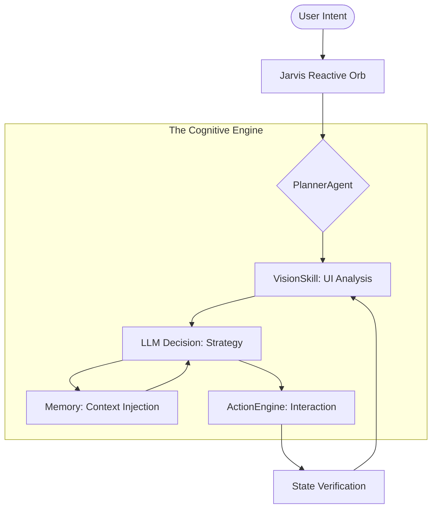

<p align="center">
  
</p>

<h1 align="center">🌌 JARVIS AI: SENTINEL OS</h1>
<p align="center">
  <b>The Future of Autonomous Mobile Interaction</b><br>
  <i>A professional-grade personal intelligence layer for Android.</i>
</p>

<p align="center">
  
  
  
</p>

<p align="center">
  
</p>

<p align="center">
  <a href="#-why-jarvis">Why Jarvis?</a> •
  <a href="#-key-features">Features</a> •
  <a href="#-architecture">Architecture</a> •
  <a href="#-setup-guide">Setup</a> •
  <a href="#-contributing">Contribute</a>
</p>

---

## 📱 Experience True Autonomy

Jarvis isn't just a chatbot; it's a **Sentinel**. It observes your screen, understands your intent, and executes tasks with human-like precision. By removing the friction between thought and action, Jarvis becomes your digital twin.

<p align="center">
  <table align="center">
    <tr>
      <td align="center">
        <br>
        <i>Intelligent Conversation</i>
      </td>
      <td align="center">
        <br>
        <i>Autonomous Control</i>
      </td>
    </tr>
  </table>
</p>

---

## ❓ Why Jarvis?

Traditional assistants (Siri, Google Assistant) are "walled gardens"—they only work with apps that have specific integrations. **Jarvis breaks those walls.**

| Feature | Jarvis AI | Traditional Assistants |
| :--- | :--- | :--- |
| **Vision** | See & Understands any UI | Limited to API-supported apps |
| **Autonomy** | Executes multi-step workflows | Single-command responses |
| **Privacy** | 100% Local Episodic Memory | Cloud-based data harvesting |
| **Control** | Human-like gestures (Tap/Swipe) | Intent-based API calls |

---

## 🧠 The Cognitive Loop

Jarvis operates on a high-fidelity **Multi-Agent Orchestration** model.



---

## 🔬 Technical Logics

### 🛠 ActionEngine Mechanics
The `ActionEngine` translates AI strategy into hardware reality.
*   **Coordinate Normalization:** Maps relative coordinates (0-1000) to device-specific pixel densities.
*   **Adaptive Gestures:** Uses Bezier curves for natural, human-like swipes.

### 📁 Memory Hierarchy (RAG v4)
*   **L1 (Reactive):** Current conversation context.
*   **L2 (Episodic):** Local vector store (ChromaDB) for historical recall.
*   **L3 (Routine):** Predictive engine for habit-based task pre-warming.

---

## 🤖 Model Compatibility Matrix

Jarvis supports any OpenAI-compatible API, but is optimized for the following:

| Model | Role | Performance |
| :--- | :--- | :--- |
| **GPT-4o** | Primary Reasoning | ⭐⭐⭐⭐⭐ |
| **Claude 3.5 Sonnet** | Vision/Strategy | ⭐⭐⭐⭐⭐ |
| **Llama 3.1 (Local)** | Routine Prediction | ⭐⭐⭐⭐ |
| **Gemini 1.5 Pro** | Long-context Memory | ⭐⭐⭐⭐ |

---

## 🤝 Contributing

We are building the future of mobile intelligence, and we need your help!
- **Build a Skill:** Want Jarvis to control a new app? Write a `Skill` in Kotlin.
- **Improve Vision:** Help us tune our TFLite models for better icon recognition.
- **Memory Refinement:** Optimize our vector retrieval logic.

Check out our [**Contributing Guide**](docs/internal/CONTRIBUTING.md) to get started.

---

## 🔧 Setup & Quickstart

```bash
# Clone and build the Sentinel
git clone https://github.com/patil-shubham-dev/Jarvis-Ai.git
cd Jarvis-Ai/app
./gradlew installDebug
```

> [!IMPORTANT]
> Jarvis requires **Accessibility Service** permissions to observe and interact with your device.

---

<p align="center">
  <b>Jarvis AI: Sentinel OS</b><br>
  Developed with ❤️ by <a href="https://github.com/patil-shubham-dev">Shubham Patil</a><br>
  <i>Leading the transition to Agentic Computing.</i>
</p>
