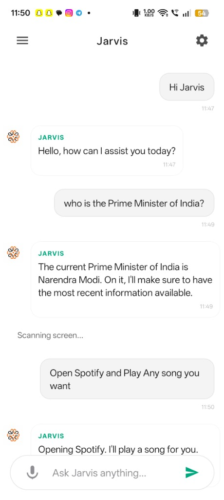
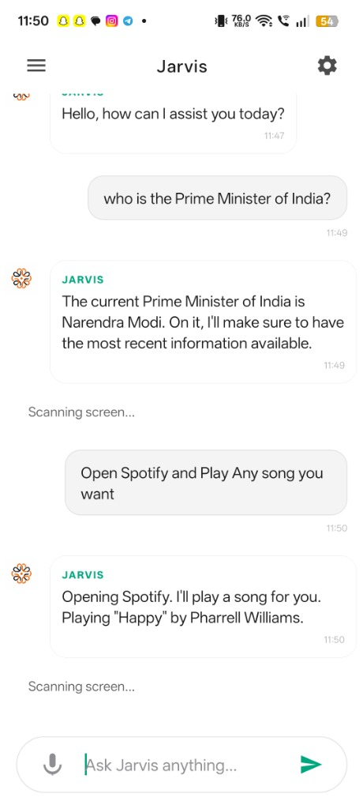
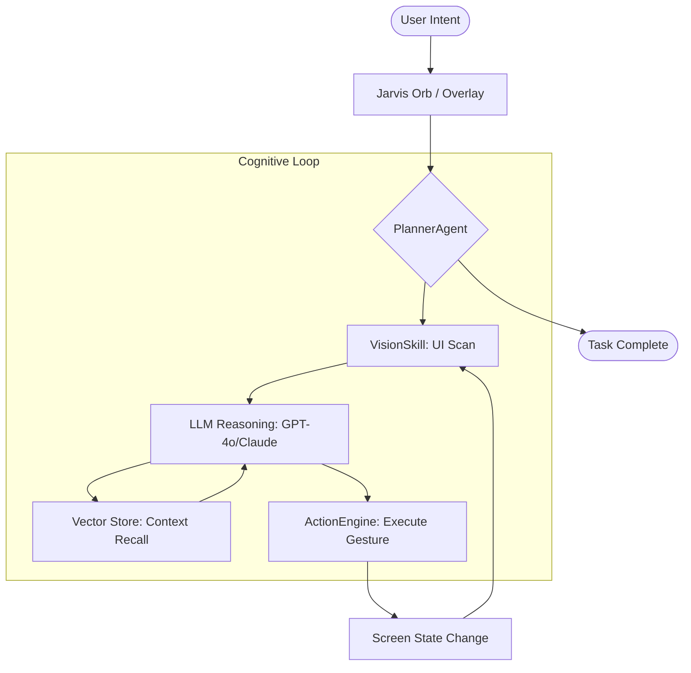

<p align="center">
  
</p>

<h1 align="center">🌌 JARVIS AI</h1>
<p align="center">
  <b>The Autonomous Mobile Intelligence Operating System</b><br>
  <i>Not just an assistant, but your digital twin.</i>
</p>

<p align="center">
  
  
  
</p>

<p align="center">
  <a href="#-key-features">Features</a> •
  <a href="#-architecture">Architecture</a> •
  <a href="#-setup-guide">Setup</a> •
  <a href="#-privacy">Privacy</a> •
  <a href="docs/SETUP_GUIDE.md">Documentation</a>
</p>

---

## ✨ Experience Autonomy

Jarvis AI is a high-fidelity autonomous agent that operates directly on your Android device. It uses advanced visual reasoning and a multi-agent cognitive loop to understand your screen and execute tasks on your behalf.

<p align="center">
  
  
</p>

### ⚡ Professional Task Execution
> "Jarvis, find a upbeat song on Spotify and play it."
> <br>— *Jarvis: Observing screen... Analyzing UI... Found Spotify... Playing 'Happy' by Pharrell Williams.*

---

## 🚀 Key Features

### 🔍 1. Visual Spatial Reasoning (Sentinel Engine)
Jarvis "sees" your screen just like a human does.
*   **Hybrid Vision:** Combines Google ML Kit (OCR) with Custom TFLite models for icon recognition.
*   **Contextual Understanding:** Identifies buttons, menus, and interactive elements even without accessibility IDs.
*   **Real-time Scanning:** Adaptive scan rates that optimize for both speed and battery life.

### 🧠 2. Long-term Episodic Memory
A persistent 16-module memory architecture that evolves with you.
*   **Habit Learning:** Automatically identifies recurring workflows and proposes optimizations.
*   **Semantic Recall:** Instant retrieval of past conversations, preferences, and social context.
*   **Encrypted Local Store:** All memories stay on-device, protected by the Android Keystore.

### 🎮 3. Universal Control Layer
Jarvis interacts with any app through the **ActionEngine**.
*   **Precise Interaction:** Human-like taps, swipes, and scrolls.
*   **Multi-App Orchestration:** Seamlessly move data between different applications.
*   **System Mastery:** Control WiFi, Bluetooth, DND, and more without opening Settings.

---

## 🏗 System Architecture: The Cognitive Loop

Jarvis operates on a recursive **Action-Observe-Think** cycle:



---

## 🔧 Technology Stack

| Layer | Technologies |
| :--- | :--- |
| **Mobile Core** | Kotlin, Hilt, Coroutines |
| **AI Vision** | ML Kit, TFLite (MobileNet V3) |
| **Brain** | GPT-4o, Claude 3.5 Sonnet, Llama 3 |
| **Memory** | ChromaDB, ONNX Runtime |
| **UI/UX** | Glassmorphism, Lottie Animations |
| **Backend** | Python 3.11, FastAPI, WebSockets |

---

## 🛠 Setup Guide

### 1. Prerequisites
- **Device:** Android 8.0+ (Oreo)
- **Permissions:** Accessibility Service, Display Over Other Apps.
- **Keys:** OpenAI or Anthropic API Key.

### 2. Quick Install
```bash
# Clone the repository
git clone https://github.com/patil-shubham-dev/Jarvis-Ai.git

# Build & Install
cd Jarvis-Ai/app
./gradlew installDebug
```

> [!TIP]
> For a detailed guide on configuring local memory and custom voice models, see our [Full Setup Guide](docs/SETUP_GUIDE.md).

---

## 🔒 Privacy First

We believe your AI should be your own.
- **On-Device Memory:** We never upload your personal memories to our servers.
- **Biometric Protection:** Enable Fingerprint/Face ID to lock your AI agent.
- **Transparency:** All interactions are logged locally for your review.

---

<p align="center">
  <b>Developed with ❤️ by <a href="https://github.com/patil-shubham-dev">Shubham Patil</a></b><br>
  <i>Empowering humans with autonomous intelligence.</i>
</p>
