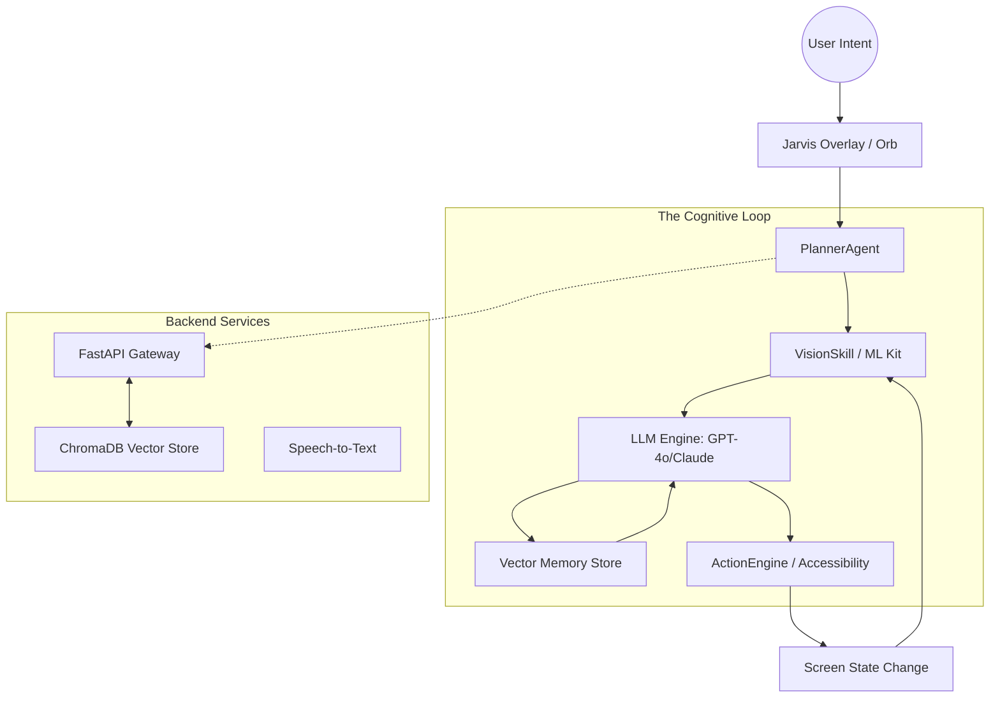

# 🌌 JARVIS AI — The Autonomous Mobile Intelligence OS


[](https://opensource.org/licenses/MIT)
[](https://www.android.com/)
[](https://nextjs.org/)
[](#)

**Jarvis AI** is a professional-grade, autonomous mobile agent designed to transform your Android device into a self-operating personal assistant. By combining **Visual Reasoning (OCR + Labeling)**, **Multi-Step Task Planning**, and **Long-term Episodic Memory**, Jarvis doesn't just chat—it *acts*.

---

## 🚀 Vision: Beyond Chatbots

Most AI assistants are confined to a text box. Jarvis breaks these barriers by operating directly on the OS layer, capable of navigating apps, managing system settings, and executing complex workflows through human-like interaction.

### 🌟 Key Pillars
*   **Observe:** Real-time screen analysis using Google ML Kit and Custom TFLite models.
*   **Think:** Intelligent reasoning via GPT-4o, Claude 3.5, or local LLMs.
*   **Act:** Precision control through Android Accessibility Services (Tap, Swipe, Type).
*   **Remember:** A 16-module vector memory system that stores habits, preferences, and social graphs.

---

## 🛠 Features Breakdown

### 📱 1. Autonomous Mobile Control (Sentinel Engine)
The core of Jarvis is the **Sentinel V4.1** engine, which enables:
- **App Navigation:** "Open WhatsApp and tell Mom I'll be late."
- **System Automation:** Managing WiFi, Bluetooth, DND, and Volume based on context.
- **Visual Spatial Reasoning:** Locating buttons and icons even when their internal IDs are obfuscated.

### 🧠 2. Hyper-Personalized Memory
Jarvis maintains a persistent "Digital Twin" of your digital life:
- **Episodic Memory:** Remembers past conversations and successful workflows.
- **Habit Detection:** Learns your routines (e.g., "Playing Spotify when the gym WiFi connects").
- **Semantic Retrieval:** Uses ChromaDB/Vector store to inject relevant user context into every prompt.

### 🎨 3. Futuristic Glassmorphism UI
A premium interface designed for the next generation of computing:
- **The Jarvis Orb:** A central, reactive entity with smooth Lottie animations for different AI states.
- **Overlay Mode:** A non-intrusive floating bubble that allows Jarvis to assist you while you use other apps.
- **Dynamic Theming:** Deep matte aesthetics with vibrant radial glows.

---

## 🏗 System Architecture



---

## 🔧 Technology Stack

| Layer | Technologies |
| :--- | :--- |
| **Mobile Core** | Kotlin, Coroutines, Jetpack Lifecycle |
| **Dependency Injection** | Hilt |
| **AI Vision** | Google ML Kit (OCR/Labeling), TFLite (MobileNet V3) |
| **Backend** | Python, FastAPI, WebSockets |
| **Vector DB** | ChromaDB, ONNX Runtime |
| **Web UI** | Next.js 14, TailwindCSS, Framer Motion |
| **Automation** | Android Accessibility Service |

---

## 🚀 Detailed Setup Guide

### 1. Prerequisites
- **Android Device:** Android 8.0+ (API 26+)
- **Storage:** 150MB+
- **API Keys:** OpenAI (Recommended), Anthropic, or Nvidia NIM.

### 2. Installation
**From Source:**
```bash
# Clone the repository
git clone https://github.com/patil-shubham-dev/Jarvis-Ai.git

# Build the Android APK
cd Jarvis-Ai/app
./gradlew assembleDebug

# Start the Backend (Optional for local memory)
cd ../backend
pip install -r requirements.txt
uvicorn main:app --reload
```

### 3. Permissions Checklist
To enable full autonomy, Jarvis requires:
1.  **Accessibility Service:** Allows Jarvis to "see" and "click."
2.  **Display Over Other Apps:** Enables the floating Jarvis Orb.
3.  **Background Execution:** Prevents the OS from killing the agent during long tasks.

---

## 🔒 Privacy & Security

*   **Local-First Design:** Sensitive memory modules are stored on-device.
*   **Encrypted Storage:** Uses Android Keystore and EncryptedSharedPreferences for API keys.
*   **Biometric Guard:** Secure your personal AI with fingerprint or face ID.
*   **No Data Selling:** Your interaction data belongs to you. Period.

---

## 🗺 Roadmap

- [ ] **Phase 1:** Stable "Observe-Think-Act" loop (Done)
- [ ] **Phase 2:** Multi-device sync & Browser control (In Progress)
- [ ] **Phase 3:** Full Offline LLM integration (Planned)
- [ ] **Phase 4:** proactive Habit execution (Planned)

---

## 🤝 Contributing

We love contributors! 
1. Fork the Project.
2. Create your Feature Branch (`git checkout -b feature/AmazingFeature`).
3. Commit your Changes (`git commit -m 'Add some AmazingFeature'`).
4. Push to the Branch (`git push origin feature/AmazingFeature`).
5. Open a Pull Request.

---

## 📜 License

Distributed under the MIT License. See `LICENSE` for more information.

---

<p align="center">
  <b>Jarvis AI — Not just an assistant, but your digital twin.</b><br>
  Developed with ❤️ by <a href="https://github.com/patil-shubham-dev">Shubham Patil</a>
</p>
